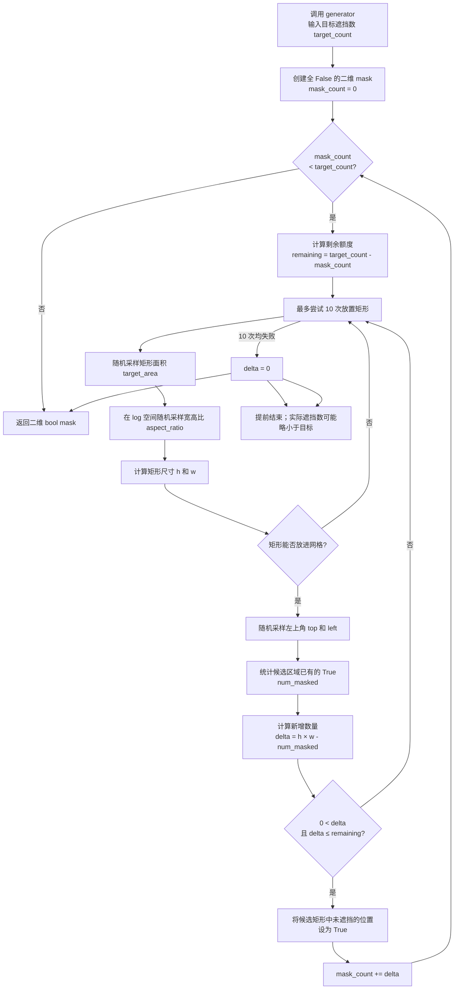
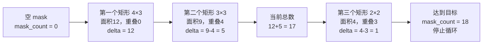

# DINOv2 数据处理流程

本文档说明 DINOv2 自监督预训练中，一张原始图片如何经过数据集读取、图像解码、多裁剪增强、批次拼接和 iBOT 掩码生成，最终变成送入 student/teacher 网络的张量。

本目录是从仓库中的完整参考实现 `dinov2-main/dinov2/data` 梳理出的学习版实现。代码保留了标准 RGB 图像的核心训练流程，并加入了中文注释。细胞图像、多通道 TIFF 和评估结果聚合不属于标准 DINOv2 预训练主路径，因此没有混入核心流程。

## 1. 总体流程

```text
config.yaml
  │
  ├─ train.dataset_path          选择数据集及路径
  ├─ crops.*                    控制全局/局部裁剪
  └─ ibot.*                     控制掩码概率与比例
       │
       ▼
make_dataset()                  解析数据集字符串，创建 Dataset
       │
       ▼
ExtendedVisionDataset.__getitem__()
  ├─ get_image_data()           从 JPEG 文件或 ImageNet-22k tar 中读取 bytes
  ├─ ImageDataDecoder.decode()  bytes → RGB PIL.Image
  └─ DataAugmentationDINO()     一张图 → 2 个 global crop + N 个 local crop
       │
       ▼
Sampler + DataLoader            多进程读取、分布式切分、组成 batch
       │
       ▼
collate_data_and_cast()
  ├─ 堆叠 global crops
  ├─ 堆叠 local crops
  ├─ 为一部分 global crops 生成连续块状 patch mask
  ├─ 计算 masked patch 的扁平索引和样本权重
  └─ 将图像转换为训练精度（通常 FP16）
       │
       ├─ teacher：只接收 2 个 global crops，且不使用遮挡后的图像
       └─ student：接收 global crops + local crops；global 分支参与 iBOT 掩码学习
```

## 2. 配置如何影响数据

以当前 `config.yaml` 为例：

```yaml
train:
  dataset_path: ImageNet22k
  batch_size_per_gpu: 32
  num_workers: 10

crops:
  global_crops_scale: [0.32, 1.0]
  global_crops_size: 224
  local_crops_scale: [0.05, 0.32]
  local_crops_size: 98
  local_crops_number: 8

ibot:
  mask_sample_probability: 0.5
  mask_ratio_min_max: [0.1, 0.5]

student:
  patch_size: 14
```

含义如下：

- 每张原图产生 `2` 个 `224×224` 全局视图。
- 每张原图产生 `8` 个 `98×98` 局部视图。
- 全局视图覆盖原图面积的 `32%～100%`。
- 局部视图覆盖原图面积的 `5%～32%`。
- 每个全局视图含 `(224 / 14)^2 = 256` 个 patch token。
- 一个 batch 中约 `50%` 的全局视图会被分配 iBOT mask。
- 被选中的视图遮挡约 `10%～50%` 的 patch；实际值可能因矩形重叠、边界和整数取整略小于目标值。

注意：当前 `local_crops_size=98` 能被 `patch_size=14` 整除。如果修改尺寸，应尽量保证 crop size 是 patch size 的整数倍。

## 3. 单张图片的增强

`DataAugmentationDINO.__call__()` 对同一张图片独立采样多个视图。

### 3.1 两个全局视图

共同的几何与颜色处理：

1. `RandomResizedCrop(224, scale=[0.32, 1.0])`
2. `RandomHorizontalFlip(p=0.5)`
3. `ColorJitter`，以 `0.8` 概率执行
4. `RandomGrayscale(p=0.2)`

两个全局视图使用不同的额外增强：

- global crop 1：强高斯模糊。
- global crop 2：弱高斯模糊，并以 `0.2` 概率执行 solarization。

最后统一执行：

```text
PIL.Image → float Tensor [C,H,W]，范围约为 [0,1]
          → ImageNet mean/std 标准化
```

### 3.2 局部视图

每个局部视图独立执行：

1. `RandomResizedCrop(98, scale=[0.05, 0.32])`
2. 水平翻转
3. 颜色扰动和灰度化
4. 中等概率高斯模糊
5. 转 Tensor 并标准化

局部视图只交给 student。它迫使 student 从局部内容预测 teacher 在全局视图上产生的语义目标，从而获得尺度和视角不变性。

### 3.3 单样本输出结构

```python
{
    "global_crops": [Tensor[C, 224, 224], Tensor[C, 224, 224]],
    "global_crops_teacher": [Tensor[C, 224, 224], Tensor[C, 224, 224]],
    "local_crops": [Tensor[C, 98, 98], ...],  # 共 local_crops_number 个
    "offsets": (),
}
```

`global_crops_teacher` 当前与 `global_crops` 指向相同的两个增强结果。teacher/student 的区别在模型前向阶段产生，而不是重复执行图像增强。

## 4. Batch 拼接顺序

设 DataLoader batch size 为 `B`，全局视图数为 `G=2`，局部视图数为 `L=8`。

`collate_data_and_cast()` 按“视图优先、样本其次”的顺序堆叠：

```text
global_0(sample_0 ... sample_B-1),
global_1(sample_0 ... sample_B-1)
```

因此：

```text
collated_global_crops.shape = [G*B, C, 224, 224]
collated_local_crops.shape  = [L*B, C,  98,  98]
```

这种顺序让后续模型可以用连续切片快速取出同一 crop 类型的整批数据。

## 5. iBOT 掩码生成

掩码只按照全局视图的 patch 网格生成。以 `224×224`、patch size `14` 为例：

```text
patch grid = 16 × 16
N = 256 patches
```

`MaskingGenerator` 不会独立随机遮挡零散 patch，而是反复采样矩形，并且只统计矩形中**尚未被遮挡的位置**。

### 5.1 `MaskingGenerator` 完整流程图



矩形尺寸由随机面积和宽高比计算：

```text
h ≈ √(target_area × aspect_ratio)
w ≈ √(target_area ÷ aspect_ratio)
```

核心计数逻辑：

```python
num_masked = mask[top : top + h, left : left + w].sum()
delta = h * w - num_masked

if 0 < delta <= remaining:
    mask[top : top + h, left : left + w] = True
    mask_count += delta
```

### 5.2 矩形重叠计数示例

下面用目标遮挡数 `18` 演示多个随机矩形的累积过程：



关键点：

1. 矩形面积不等于新增遮挡数，必须减去与旧 mask 重叠的部分。
关键点：

1. 矩形面积不等于新增遮挡数，必须减去与旧 mask 重叠的部分。
> 重叠位置已经是 `True`，不会重复计入 `mask_count`；最终 mask 是多个随机矩形的并集。
3. 如果 `delta` 大于剩余额度，候选矩形会被拒绝并重新采样。
4. 最终 mask 是多个随机矩形的**并集**，所以形成连续区域而不是离散随机点。

1. 随机选择矩形面积。
2. 在对数空间随机选择宽高比。
3. 随机选择左上角。
3. 如果 `delta` 大于剩余额度，候选矩形会被拒绝并重新采样。
4. 最终 mask 是多个随机矩形的**并集**，所以形成连续区域而不是离散随机点。
5. 重复上述过程，直到达到目标数量或无法继续添加。

`collate_data_and_cast()` 进一步完成：

- `collated_masks`：`[2B, N]` 的布尔矩阵。
- `mask_indices_list`：将 `[2B, N]` 展平后，所有 `True` 位置的索引。
- `masks_weight`：每个 masked patch 的权重为 `1 / 当前样本的 masked patch 数`。
- `n_masked_patches`：当前 batch 真正被遮挡的 patch 总数。
- `upperbound`：为 masked-token buffer 预留空间时使用的保守上界。

按样本归一化 `masks_weight` 后，一个遮挡很多 patch 的样本不会仅仅因为 patch 更多而主导 iBOT loss。

## 6. Dataset 如何读取图像

### ImageNet-1k

`ImageNet` 使用预先生成的 `.npy` 元数据索引：

- `entries-TRAIN.npy` / `entries-VAL.npy`
- `class-ids-*.npy`
- `class-names-*.npy`

索引记录类别、文件编号和相对路径信息。`get_image_data()` 根据索引打开 JPEG 文件并返回原始字节。

配置字符串示例：

```text
ImageNet:split=TRAIN:root=D:/datasets/imagenet:extra=D:/datasets/imagenet-extra
```

### ImageNet-22k

`ImageNet22k` 假设每个类别保存为一个 tar 文件。初始化时载入：

- `entries.npy`：每张图片所属类别、tar 内起止偏移量等。
- `class-ids.npy`：类别索引到类别 ID 的映射。

读取时通过 `mmap` 直接切出 tar 中对应的字节区间，跳过 512 字节 tar header；这样无需每次遍历或解压整个 tar。少量内部仍为 gzip 的样本会额外解压。

配置字符串示例：

```text
ImageNet22k:root=D:/datasets/imagenet22k:extra=D:/datasets/imagenet22k-extra
```

仅写 `ImageNet22k` 时，数据根目录必须由项目其他配置或代码补充；原始实现本身要求 `root` 和 `extra`。

### 小数据集快速验证：Imagenette2-160

完整 ImageNet-1k 体积很大，而且官方数据需要申请访问。只想验证手写模型的
数据流、前向、反向传播和 loss 是否正常时，可以先使用 Imagenette2-160：

- 从 ImageNet 中选出的 10 个类别；
- 图片短边缩放到 160 像素，压缩包约 95 MiB；
- 已按 `train/类别/图片` 和 `val/类别/图片` 排列，不需要生成 ImageNet 的
  `.npy` 元数据索引。

本仓库提供下载脚本：

```powershell
.venv\Scripts\python.exe dinov2-m\scripts\download_imagenette.py
```

下载后，训练集可以这样交给当前数据工厂：

```python
from dinov2.data import DataAugmentationDINO
from dinov2.data.loaders import make_dataset

augmentation = DataAugmentationDINO(
    global_crops_scale=(0.32, 1.0),
    local_crops_scale=(0.05, 0.32),
    local_crops_number=2,
    global_crops_size=112,
    local_crops_size=56,
)

dataset = make_dataset(
    dataset_str="ImageFolder:root=datasets/imagenette2-160/train",
    transform=augmentation,
    # DINOv2 是自监督训练，不使用类别标签。
    target_transform=lambda _: (),
)
```

也可以把配置中的数据集路径改为：

```yaml
train:
  dataset_path: ImageFolder:root=datasets/imagenette2-160/train
```

Imagenette2-160 可以继续裁剪成 224，但上采样不会产生新的图像细节。快速冒烟
测试推荐先用 `global_crops_size=112`、`local_crops_size=56`；两者都能被默认
`patch_size=14` 整除，并能明显降低显存和计算量。

## 7. Sampler 与分布式训练

标准预训练使用 `ShardedInfiniteSampler`：

- 数据索引可以无限循环，训练长度由 iteration 数而不是 Dataset epoch 决定。
- 每个分布式 rank 只读取属于自己的索引切片。
- 每轮排列都可重复生成，便于固定随机种子和恢复训练。
- `advance` 可以跳过已经消费的样本，但参考训练入口目前把它设为 `0`。

`DataLoader` 还会开启：

- `pin_memory=True`：加快 CPU 到 CUDA 的异步拷贝。
- `drop_last=True`：保证各训练 step 的 batch 大小一致。
- 多 worker 并行读取与增强。

## 8. 最终 batch 字典

训练循环收到的数据形态为：

```python
{
    "collated_global_crops": Tensor[2*B, C, global_size, global_size],
    "collated_local_crops": Tensor[L*B, C, local_size, local_size],
    "collated_masks": Tensor[2*B, N],             # bool
    "mask_indices_list": Tensor[num_masked],      # long
    "masks_weight": Tensor[num_masked],           # float
    "upperbound": int,
    "n_masked_patches": Tensor[1],                # long
}
```

之后模型大致按如下方式消费：

```text
teacher(global crops)                 → DINO/iBOT targets
student(global crops, masks)          → 全局 DINO loss + masked patch iBOT loss
student(local crops)                  → local-to-global DINO loss
```

标签在自监督预训练中不会参与损失计算，因此训练入口通常使用 `target_transform=lambda _: ()` 丢弃类别标签。

## 9. 文件职责

| 文件 | 职责 |
| --- | --- |
| `augmentations.py` | 从一张图片生成 global/local 多视图 |
| `transforms.py` | 高斯模糊、Tensor 转换、标准化和分类变换 |
| `masking.py` | 生成连续矩形块状 patch mask |
| `collate.py` | 拼接 batch、生成 mask 及 loss 权重、转换 dtype |
| `loaders.py` | 解析数据集配置、创建 Dataset/Sampler/DataLoader |
| `samplers.py` | epoch、无限流及分布式无限流采样 |
| `datasets/extended.py` | “读取 bytes → 解码 → transform”的通用 Dataset 模板 |
| `datasets/decoders.py` | 将图片字节解码为 RGB PIL 图像 |
| `datasets/image_net.py` | ImageNet-1k 文件和元数据索引读取 |
| `datasets/image_net_22k.py` | 使用 mmap 从 ImageNet-22k tar 中读取图片 |

## 10. 阅读建议

建议按照下面的顺序阅读代码：

1. `augmentations.py`
2. `masking.py`
3. `collate.py`
4. `datasets/extended.py`
5. `loaders.py`
6. `samplers.py`
7. `datasets/image_net.py` 或 `datasets/image_net_22k.py`

前三个文件解释“图片如何变成训练 batch”，后面的文件解释“图片从哪里来以及多卡环境如何稳定取样”。
